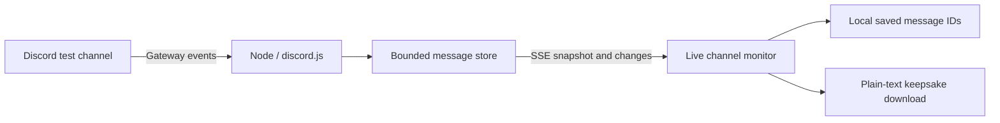

# Pocket Post

A terminal-inspired, read-only monitor for one Discord channel. Real HTML controls, monospaced typography, compact rows, and separate browser/source indicators keep the live message path visible. Search, pause, privately save messages, or export saved messages as text.

Use it as a focused shared display during a community event, or a dedicated monitor for an intentionally public announcements channel. People still write in Discord; this is a simpler viewing surface, not a replacement chat client or permission bypass. Do not publish a private support channel without viewer access controls.

## Run locally

The interface calls private saved messages **Bookmarks**: use **Bookmark / Bookmarked**, open the **Bookmarks** tab, or choose **Export bookmarks**. Existing browser selections are preserved; the storage format has not changed. Exports are named `pocket-post-bookmarks.txt`. These are personal bookmarks, not public Discord reactions.

Use Node.js 22.12+ and npm.

```sh
npm ci
npm run demo
```

Open http://localhost:3000. Demo mode is explicitly labeled and uses generated sample notes. It does not prove a real Discord connection works.

For real messages, create a `.env` file using `.env.example`:

```dotenv
DEMO_MODE=false
DISCORD_BOT_TOKEN=your_bot_token
DISCORD_CHANNEL_ID=your_channel_id
PORT=3000
```

Run `npm start`. Stop an existing demo server first. The `npm run demo` command forces demo mode even when the file says false. In PowerShell, use `$env:DEMO_MODE='true'` followed by `npm start` to run the demo.

Never commit or share your token. Missing real-mode credentials cause startup to fail clearly.

## Connect Discord

1. Create a dedicated test server and text channel. Tell participants that the website will display its messages publicly.
2. Create an application in the [Discord Developer Portal](https://discord.com/developers/applications).
3. In Bot settings, obtain the bot token and enable **Message Content Intent**. Save the token privately in `.env`.
4. Under Installation, configure Guild Install with the `bot` scope and **View Channel** and **Read Message History** permissions. Open the installation link and install the bot into your server. Administrator and Send Messages are unnecessary.
5. Enable Discord Developer Mode, right-click the channel, and copy its ID into `DISCORD_CHANNEL_ID`.
6. Start the server, post a note, then edit and delete it to verify the complete path.

The bot reads exactly one channel ID; posting in a thread or a different channel will not appear. Discord explains intents in its [Gateway documentation](https://docs.discord.com/developers/events/gateway).

## How the solution works



One Node process serves the static frontend and owns the Discord connection. The frontend depends on the backend for every source message. The bot token never reaches the browser.

The bot loads up to 100 recent messages on startup and Gateway recovery. Creates and edits upsert by message ID; individual and bulk deletes remove messages. The store retains at most 200 in chronological order, and the browser displays newest first. History and buffered live changes are assembled in a temporary store and published atomically, so a failed refresh cannot expose partial history. Generation and revision guards reject stale asynchronous completions after disconnects, newer edits, or deletion. The pending buffer is capped at 1,000 IDs; overflow requests process restart.

Failed synchronization retries with exponential backoff from one to 30 seconds. Recovery must finish within two minutes; otherwise the process exits nonzero so the configured Railway restart policy can intervene. Locally, restart `npm start` after a fatal exit. Successful recovery clears retry/deadline timers. See [the failure behavior and regression tests](docs/reliability.md).

The browser connects to `/api/events` using EventSource. Each connection receives a `snapshot` containing messages and source status, followed by `message`, `delete`, and `status` events. A fresh snapshot reconciles browser reconnections. Heartbeat comments keep idle streams active. Slow consumers are disconnected, and a global cap allows up to 100 simultaneous stream clients.

`/healthz` checks HTTP availability. `/readyz` returns 200 only when the source is synchronized/connected, otherwise 503; `/api/status` exposes source status and the last successful history-sync time. Readiness is tracked state, not an independent end-to-end delivery probe. A healthy web server does not guarantee Discord delivery.

Hearts store only selected message IDs in localStorage, scoped by source mode and server/channel names. They are personal browser bookmarks, not Discord reactions or shared votes. Saved notes follow source edits and disappear when deleted or evicted from the retained window. The download contains all currently available hearted notes, irrespective of the search filter, with author names, timestamps, text, attachment links, and original-message links. It is a plain-text file, not executable HTML.

| File | Responsibility |
| --- | --- |
| `server/index.js` | Configuration, startup, graceful shutdown |
| `server/discord.js` | Gateway events, exact channel filter, history synchronization |
| `server/store.js` | Safe field selection, ordering, bounded retention |
| `server/app.js` | HTTP, SSE, security headers, static files |
| `server/demo.js` | Explicit synthetic demo source |
| `public/app.js` | Message rows, source state, private bookmarks, search, pause, export |
| `public/index.html`, `public/styles.css` | Responsive terminal-inspired layout |

## Catch me up: chat-style channel recaps

Use the **Catch me up** text box at the top of the insights sidebar, then choose **Open recap chat**. Your request is carried into the dialog without automatically sending it. Choose **1 week**, **2 weeks**, **30 days**, or enter any 1–30-day range. Leave Member blank for everyone, or enter an exact display name / select a Discord member ID. Press **Summarize** or type a supported command:

```text
summarize last 2 weeks
recap from Arshiya last 7 days
questions
```

Each request is independent; selected filters persist. `questions` selects messages containing question marks, not verified unanswered questions. This is a focused summary command interface, not a general-purpose chatbot.

`POST /api/summary` validates the range/member/request, retrieves history separately from the live store, and returns an **extractive recap**: counts, repeated terms, and up to six representative source-linked excerpts. In the default local mode, nothing is sent to an external AI provider and no additional API key is needed. The method ranks original message text using word frequency and deduplicates excerpts. Optional OpenRouter synthesis adds a short AI-written brief with validated source IDs; see setup below.

In real mode, the existing bot fetches older messages on demand with Discord's [paginated channel history API](https://docs.discord.com/developers/resources/message#get-channel-messages). Pages contain at most 100 messages; traversal stops at the requested start, the end of accessible history, or 30 pages (3,000 scanned messages). Busy channels can exceed this limit even in one week. The response and UI explicitly label partial coverage. Demo mode summarizes only retained synthetic messages and never claims week-long coverage.

Member filtering uses stable author IDs; duplicate display names require selecting an ID. Suggestions cover members seen in the live window or most recent recap, not a complete server roster. Recaps use message creation time in a rolling UTC window, not calendar weeks. Edits read during retrieval are reflected, but pagination is not a transactional Discord snapshot. Existing recaps are point-in-time results and must be rerun after edits/deletions. Deleted messages, thread conversations, and attachment contents are not available to this summarizer.

Requests are limited to one active retrieval and a ten-second global cooldown, with a 40-second response deadline and a 2 KB JSON body limit. Underlying SDK requests may settle after the deadline; the concurrency slot remains occupied until then to prevent pileups. Raw history is not persisted or added to the live store. The chat keeps at most 12 bubbles in page memory, not localStorage. Closing the panel preserves it; **Clear chat** or a page reload removes it.

**Privacy change:** viewers can now request older accessible messages, not just the 200-message live window. This endpoint is public like the feed: use only an intentionally public/test channel. The global limit is not authentication or a full abuse-control system. Add viewer access controls before exposing sensitive historical conversations.

Implementation: `server/summary.js` owns retrieval, filtering, ranking, limits, and coverage; `public/summary-ui.js` owns the accessible chat dialog. Tests cover commands, date boundaries, duplicate members, paginated/capped history, source attribution, request errors, mobile layout, and safe rendering.

## Alternatives considered

### Optional OpenRouter setup

The adapter is implemented but is **off by default**. Add these values privately to `.env` locally or to Railway service variables, then restart:

```dotenv
SUMMARY_PROVIDER=openrouter
OPENROUTER_API_KEY=your_private_key
OPENROUTER_MODEL=your_selected_provider/model_id
LLM_REQUESTS_PER_HOUR=20
```

Choose an exact available model ID from your OpenRouter account; the placeholder above is not a real model ID. Never put the key in frontend code or commit `.env`. In **Catch me up**, select **Use AI** to approve sending selected excerpts to OpenRouter and its routed model provider for that request. Leaving the box unchecked uses local summaries. The public configuration endpoint exposes only provider name, readiness, and model—not keys.

The request uses OpenRouter's [chat completions API](https://openrouter.ai/docs/api_reference/overview). It sends at most six excerpts, each capped at 500 source characters plus an ellipsis, author names (up to 100 characters), timestamps and source IDs; it does not send the full history, attachments, bot token, filesystem, or prior recap chat. Output is capped at 700 tokens. This is a starter integration: selected excerpts can miss important context in a busy channel. The UI distinguishes retrieved-history coverage from the much smaller AI input.

Every generated point must cite an ID in the supplied excerpts. Bad IDs, malformed/truncated output, oversized provider responses, missing configuration, and provider errors visibly fall back to local output. A valid citation is **not** a factual correctness guarantee. The model receives untrusted Discord text with an instruction not to follow embedded commands; it has no tools or shell access. Responses use text-only DOM rendering and source URLs from the backend, not model-generated links.

AI has a 20-second timeout within the overall 40-second recap deadline. The default limit is 20 attempts per hour per process (configurable 1–100), in addition to the existing global concurrency/cooldown guards. Restarts reset this counter: set an OpenRouter-side spending limit and add authentication before a public paid deployment. No model calls happen automatically on message arrivals or sidebar updates.

Why not shell out to Codex? Official [non-interactive Codex documentation](https://developers.openai.com/codex/noninteractive) describes `codex exec` for automation. This service only needs text synthesis, so a direct provider call avoids introducing a coding-agent runtime, CLI login, and shell/filesystem permissions into a public HTTP request path. The OpenAI Docs skill informed this integration choice.

### Main-page insights

**What they're talking about** shows up to four estimated keyword clusters from the retained window. The local algorithm removes common filler words, URLs and markup, counts each term once per message, requires recurrence in at least two messages, and groups terms whose message sets have at least 60% Jaccard overlap. Expand a topic to inspect up to three recent supporting messages and source links. These are overlapping lexical hints, not a trained topic model, sentiment analysis, or proof of intent. They may miss synonyms, multilingual stop words, sarcasm, and context. Single-message topics deliberately do not appear. No messages leave the browser for this feature. Clusters recompute on creates, edits, deletes, and snapshots; pausing freezes the displayed feed and pulse together.

The top-bar **Light / Dark** button switches the entire page and recap dialog. Dark is the default; a browser-local preference persists across reloads when localStorage is available. Blocked storage falls back to a visit-only choice. On narrow screens the sidebar, including the recap composer, appears below the feed.

The desktop layout places a narrower feed beside **Channel pulse**. Counts show retained messages, distinct author IDs, and messages containing question marks; they are not weekly analytics or verified unanswered-question counts. Up to five members are listed by message count, explicitly not a contribution score. On mobile, insights stack below the feed. The last requested recap also appears in **Your catch-up brief** and is labeled point-in-time; open the chat to review citations. Clearing the recap chat clears this brief too.

### Other tradeoffs

- **SSE vs WebSockets:** SSE fits a one-way live channel monitor and supplies native browser reconnection. WebSockets would be useful for a future bidirectional app. Polling is simpler to host in some environments but adds latency and repeated requests.
- **Gateway vs REST polling:** discord.js manages the live Gateway protocol and reconnection. Polling channel history makes edits/deletes and rate limits harder to manage.
- **Local bookmarks vs a database:** browser-local hearts keep setup small and do not require accounts. Shared, durable guestbooks need authentication, database storage, retention rules, and deletion handling.
- **Plain messages vs automatic analysis:** the monitor preserves what people actually wrote. It does not infer sentiment, urgency, or categories. This keeps the experience understandable and avoids misleading automated labels.
- **Single service vs multiple replicas:** one process keeps the interview deployment inspectable. Multiple web instances would require a coordinated bot worker, shared storage, and pub/sub.
- **Extractive recaps vs an LLM:** the local method has no provider cost or external message disclosure and retains exact source text, but lacks semantic synthesis. OpenRouter adds optional synthesis with explicit sharing, limited input/output, and source validation; real-model quality evaluation remains necessary.
- **On-demand history vs a persistent archive:** reading from Discord avoids a second durable copy and migration/deletion machinery. It costs retrieval time and cannot guarantee complete long-range coverage on busy channels. A background archive should be added only with explicit retention and access requirements.

## Limitations

- **Public messages:** anyone with access to the deployment can read notes, authors, and attachment links. There is no viewer authentication or per-user Discord permission check. Use an intentionally public/test channel.
- **Temporary history:** restarts recover recent history, not an archive. Missed events outside that window may not be recovered. The app does not promise exactly-once delivery.
- **Hearts are not durable storage:** they are specific to a browser and source name. Renaming a server/channel changes the bookmark scope; clearing browser storage removes bookmarks. Unavailable localStorage falls back to session-only hearts with a visible notice. Download favorites before they leave the feed.
- **Downloads are independent copies:** deleting a Discord message removes it from the live feed and saved view, but cannot revoke a file someone already downloaded.
- **Limited rich content:** plain message text and attachment links are supported; embeds, reactions, full Discord formatting, and linked-thread conversations are not reproduced. Discord attachment URLs can expire.
- **One replica:** the in-memory store and bot connection are not designed for horizontal scaling. Broader public use needs access controls, per-IP limits, and operational monitoring.
- **Entry link:** “Open Discord” opens the channel using an available source message URL. Until one is available, “How to post” opens the on-page instructions.

## Deploy on Railway

1. Push the project to a Git repository and connect it to a Railway service.
2. The included Dockerfile packages the backend and frontend together.
3. Set `DISCORD_BOT_TOKEN` and `DISCORD_CHANNEL_ID` as Railway variables; set `DEMO_MODE=false`.
4. Keep one replica and disable Serverless/app sleeping so the outbound Gateway connection stays active.
5. Use `/healthz` as the healthcheck. The app listens on Railway's `PORT`. Generate a public HTTPS domain.
6. Open the public URL and verify real Discord messages, edits, and deletes before submission.

See Railway's [healthcheck documentation](https://docs.railway.com/deployments/healthchecks) and [Serverless behavior](https://docs.railway.com/deployments/serverless).

Railway deployment remains unverified and no submission email has been sent. The Docker image has not been built locally because the Docker daemon was unavailable.

## Verify and discuss

```sh
npm test
npm run check
npm run test:browser
```

The browser suite requires locally installed Google Chrome. It starts an isolated demo server on port 3100 so the real server on 3000 can remain running. Backend tests use mocked Discord lifecycle events and real local HTTP streams. Browser tests cover live arrivals, search, pause/resume, mobile layout, safe text rendering, edits/deletes, saved hearts across reloads, and actual downloaded keepsake contents.

The suite contains 30 unit/backend tests and nine browser tests, including failed/late history requests, retry deadlines, stale edits, avatar failures, stream capacity, browser reconnection, recap filtering/coverage/timeout behavior, mocked OpenRouter validation/fallback, per-request AI consent, topic clustering, composer handoff, theme persistence, and sidebar layout. Desktop and mobile layouts are checked by the browser suite. A paid provider call has not been verified; provider tests use mocked responses.

For acceptance, repeat the message flow against the deployed real channel, including messages from multiple members, wrong-channel exclusion, and two browser windows. Check that the frontend never receives the bot token.

For the interview, trace one note from the Gateway handler to its message row, then explain reconnect snapshots, bounded history, and the distinction between bookmarks and durable storage. Discuss how a shared permanent guestbook would change privacy, storage, and deletion requirements.

See [the product walkthrough](docs/product-walkthrough.md) and [submission email draft](docs/submission-email.md).

For the assignment review, use [the five-minute technical walkthrough and interview questions](docs/interview-prep.md), then complete [the Railway and real-channel acceptance checklist](docs/deployment-checklist.md). The compact page leads with live messages; keepsakes remain optional. Separate browser/Discord indicators distinguish connection failures, and the last-received timestamp reports message-state delivery to the page, not network latency.
